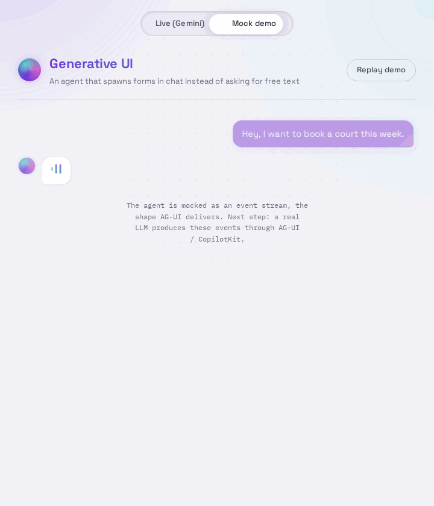

<h1 align="center">Babian Dragoș-Cristian</h1>

  Full-stack developer building real booking platforms for sports facilities, and contributing to open source on the side.

  Computer Science @ Politehnica University of Bucharest · Bucharest, Romania

  
  
  
  
  
  
  
  

## What I work on

Most of my projects come back to the same idea: taking a messy, real world process (booking a court, reserving a slot, collecting the right details) and turning it into software that people actually use. Lately I have also been drawn to how AI agents and interfaces meet, which is what pulled me into open source.

## Featured project

### Generative UI, contributed at [Xorio](https://github.com/xoriors)

A chat feature where an AI agent draws an interactive form inside the conversation instead of asking for details in plain text. The user fills it, the values flow back to the agent, and the next form is generated from them. Built as a React and TypeScript renderer over a validated JSON contract, wired live to Gemini through the AG-UI protocol and CopilotKit. My first open source contribution, taken from fork to review to merge.

  

**Stack:** React, TypeScript, AG-UI, CopilotKit, Gemini
&nbsp;·&nbsp; Merged: [PR #44](https://github.com/xoriors/experimental/pull/44), [PR #45](https://github.com/xoriors/experimental/pull/45)
&nbsp;·&nbsp; [Code »](https://github.com/xoriors/experimental/tree/main/generative-ui)

## Selected work

Full-stack booking systems I have designed and built. The source is private, and I am happy to walk through it on request.

### Star Arena Booking

An end to end B2B and B2C booking system for sports facilities. It handles time slot management, an admin dashboard with dynamic canvas rendering, and secure JWT authentication.

**Stack:** React (Vite), Tailwind CSS, Spring Boot (Java)

### Viitorul Argeș, sports base

A live booking site for a real sports base, with reservations handled over WhatsApp for football, padel and tennis courts. Shipped and in use.

**Stack:** HTML, CSS, JavaScript

## More on my profile

A hackathon project built with my team ([HackitAll RAMsarii](https://github.com/dragoscocs/HackitAll-RAMsarii)), a tennis app I contributed to ([top-tennis](https://github.com/angelstanciu/top-tennis)), and coursework that keeps the fundamentals sharp: the Knapsack problem for Algorithm Analysis (Java), object oriented programming, and functional programming in Haskell.

## Reach me

[GitHub](https://github.com/dragoscocs)
&nbsp;·&nbsp; [LinkedIn](https://www.linkedin.com/in/dragos-cristian-babian-1680b9258/)
&nbsp;·&nbsp; [dragosbabian10@gmail.com](mailto:dragosbabian10@gmail.com)
